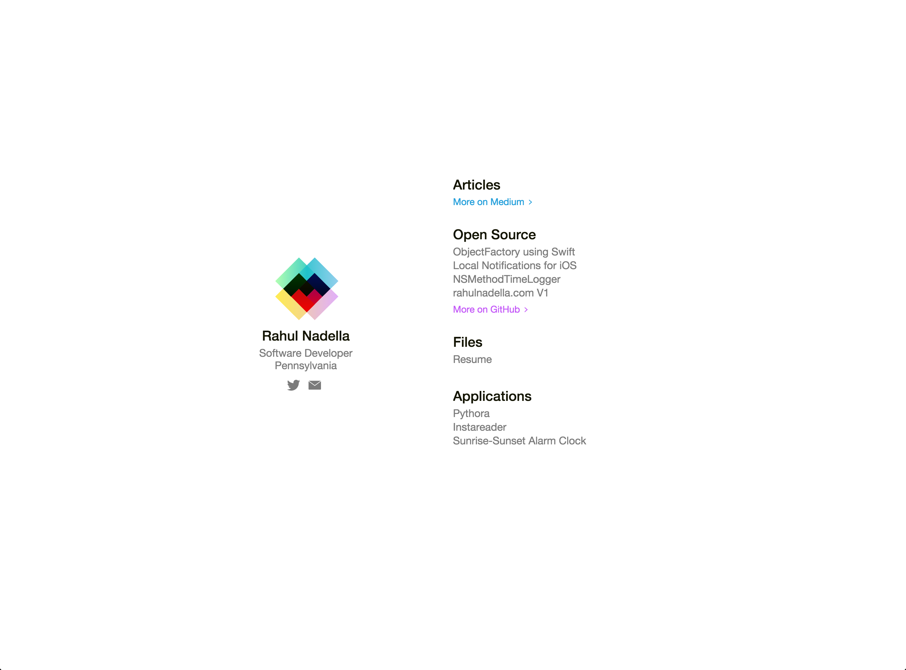

# rahulnadella.com Version 2

This is currently my implementation of my public website which is much simpler than the previous verison of my website [rahulnadella.com-version-1](https://github.com/rahulnadella/rahulnadella.com-version-1). This website was built using the combination of HTML5/CSS3/Javascript. The run the implementation of this website you will need [CoffeeScript](http://coffeescript.org/). 

Index.html (upon loading to http://rahulnadella.com)

        

